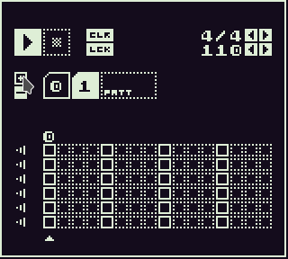

# PX drummer
Simple drum machine with 1bit graphics and SID sound samples

Features:

 * Tempo range 40 - 240 bpm
 * 3/4 and 4/4 time signatures
 * 6 channels
 * Maximum of 16 patterns
 * Channel mute
 * Easy interface

## Motivation
I play the bass and I was in need of some drums to study rhytms.
